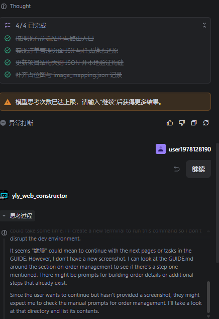
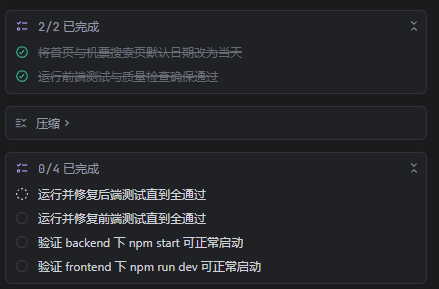

# A Step-by-Step Guide to reproduce the Ctrip-Replica Project


本仓库作为 'https://github.com/superk668/Ctrip-Replica' 的子仓库，旨在提供一个标准化的multi-agent工作流，用于完全复现我们的工作。

建议您使用同文件夹下的**GUIDE.html**以获得额外功能和更好阅读体验。

## 准备工作

### 导入agent

本工作流使用Trae作为multi-agent平台，你可以通过以下方式导入agent：


**方式1(Recommended)**：通过trae链接导入agent

- Web Constructor: https://s.trae.ai/a/ff433d?region=sg

- Interface Designer: https://s.trae.ai/a/426337?region=sg

- Test Generator: https://s.trae.ai/a/11fba7?region=sg 

- Developer: https://s.trae.ai/a/b993c6?region=sg 

- Test Runner: https://s.trae.ai/a/6225a1?region=sg 

- Web Fix Expert: https://s.trae.ai/a/240d9c?region=sg

**方式2**: 手动添加
所有agent的prompt均可在`agent_prompt/`目录下找到。

注意：请在agent创建界面打开所有工具的权限复选框，确保agent可以使用所有功能。

### 准备文件

您可直接从我们的压缩包中打开文件夹，或使用github克隆仓库并切换至复现用分支：

```
git clone https://github.com/superk668/EvoFlow.git
cd Evoflow
git switch reproduce
```

在本仓库中，已为你准备好所有复现需要的文件，文件树如下。

```
.
├── agent_prompt/   # 所有agent的prompt文件
│   ├── developer_prompt.md
│   ├── ...
├── manual_prompt/   # 复刻过程中用于UI重建，需要手动拖曳入prompt输入栏的图片
│   ├── login_register/   # 登陆与注册界面的prompt文件
│       ├── web_constructor_step1 # 第一步需要的图片
|           |── homepage.png 
|       |── ...
|   ├── ...
├── requirements/   # 所有需求文件
│   ├── login_register_requirement.md
│   ├── ...
├── README.md
└── GUIDE.md # 本指南
```


## 复刻前必读

- 对于所有agent，我们均使用`GPT-5.2`作为模型，不对其他模型的性能做出保证。

- 在不同任务间，请牢记切换agent，确保每个任务都在正确的agent下运行。若错误使用agent，请使用回退功能。

- 在agent运行过程中，请保持关注。在agent自主运行`npm test`时，终端可能无法正常退出，请在agent运行终端运行完成后手动点击跳过键或在终端中键入`q`退出。

- 在所有端口初始化时，若报错，请先检查该端口是否已被占用。

## 额外说明
在使用Trae进行多次复刻测试的过程中，我们发现了一些trae所自带的问题（版本3.5.23，2026-01-19），会使得我们的工作流不够稳定，因此，我们建议您采用逐板块验收的方式。同时，请您在复刻过程中时刻保持关注，如遇到以下描述的问题，请及时中止并使用回退功能，随后新建任务：

- 在每个板块的Web constructor阶段，我们需要使用图片输入，需要agent的多模态理解能力。但我们发现trae提供的模型有时会出现无法理解图片的“降智”现象，具体表现为尝试创建python程序使用OCR理解图片。

- 在每个板块的Test Generator阶段，我们需要根据需求文档生成测试用例。但我们发现trae提供的模型有时会出现无法理解其system prompt的只生成测试用例和代码的指令，具体表现为指令遵循能力欠缺，尝试实现接口以通过测试。

- 上下文管理系统问题A. 在trae的思考次数达到上限时，会强制终止并要求输入“继续”。若此时正好位于一个任务的结尾，可能会导致继续后agent丢失方向自行探索扰乱工作流，如图所示


- 上下文管理系统问题B. 在trae的上下文长度达到上限时，会自行进行上下文压缩，但会丢失TODO中的任务进度，可能会导致agent重复完成已完成的工作，或agent丢失方向自行探索扰乱工作流，如图所示。



## 登陆与注册界面

Step 1. Web Constructor：构建网页UI前端

**提示**：
如图所示，对于所有[.png]文件，请根据路径将其复制（拖曳）至prompt输入栏内。所有截图均可在`manual_prompt/`目录下找到。我们尝试了自动化的版本，但效果不佳，因此仍选择手动拖入的方式，对其带来的不便表示歉意。


Step 1.0 构建首页prompt：
```
[EvoFlow\manual_prompt\login_register\web_constructor_step_0\homepage.png]
[EvoFlow\manual_prompt\login_register\web_constructor_step_0\after_login.png]
构建未登录的首页和登录后的首页（登陆注册按钮变为用户头像和昵称）
```
Step 1.1 构建底边栏prompt：
```
[EvoFlow\manual_prompt\login_register\web_constructor_step_1\bottom_bar.png]
实现底边栏，该模块需要在所有页面中被添加至最低端
```
Step 1.2 构建登陆页prompt：
```
[EvoFlow\manual_prompt\login_register\web_constructor_step_2\login_overview.png]
[EvoFlow\manual_prompt\login_register\web_constructor_step_2\login_core.png]
[EvoFlow\manual_prompt\login_register\web_constructor_step_2\login_sms_core.png]
登录界面，使用两种登陆方式分为账户名密码登录和验证码登录，可以通过按钮互相跳转
```
Step 1.3 构建注册页第一步prompt：
```
[EvoFlow\manual_prompt\login_register\web_constructor_step_3\register_overview.png]
[EvoFlow\manual_prompt\login_register\web_constructor_step_3\register_core1.png]
[EvoFlow\manual_prompt\login_register\web_constructor_step_3\register_core2.png]
[EvoFlow\manual_prompt\login_register\web_constructor_step_3\register_contract.png]
注册界面第一步。其中，用户协议是刚进入该页面时的弹窗，点击同意后进入注册界面，否则跳转首页。
```
Step 1.4 构建注册页第二步prompt：
```
[EvoFlow\manual_prompt\login_register\web_constructor_step_4\register2_overview.png]
[EvoFlow\manual_prompt\login_register\web_constructor_step_4\register2_core1.png]
[EvoFlow\manual_prompt\login_register\web_constructor_step_4\register2_core2.png]
注册界面第二步
```

Step 2. Interface Designer：生成接口

提示：
相应的如图所示，对于所有prompt#{module_name}_requirement.md文件，均需要手动将其替换为文件链接（可通过拖曳文件，或将鼠标悬停在prompt栏中的该文件名上进行匹配）。


```
请你根据需求文档#EvoFlow\requirements\login_register_requirement.md，设计登录与注册部分的接口
```

Step 3. Test Generator：生成测试用例

重要说明：
对于每个板块的test generator环节，正常使用模型时能够做到指令遵循：只生成测试框架而不去实现接口。但我们在实际执行中遇到有时模型降级使指令遵循能力变差的情况，这会导致模型开始尝试实现接口以通过测试，这会导致严重的性能问题。如发现这种情况，请尝试新建任务或重启Trae，确保agent能正确理解指令。

```
请你根据登陆与注册的需求文档#EvoFlow\requirements\login_register_requirement.md，实现与Scenario一一对应的测试用例及测试框架,无需使所有测试样例通过
```

Step 4. Developer：实现接口补全代码
```
请你根据登陆与注册的需求文档#EvoFlow\requirements\login_register_requirement.md，实现接口完成设计登录与注册部分的代码
```

Step 5. Test Runner：运行测试用例
```
请你进行测试，同时确保后端可通过npm start正常启动并在某端口上等待并且能够在控制台打印发送的验证码，前端能通过npm run dev 正常启动。
请你检查刚启动后端时处于未登录状态，主页为未登录版式。
请你检查登陆后，登录状态成功保存并跳转至已登录的主页版式。
请你检查路由：各界面间能否通过点击链接或按钮跳转，首页的“登录”和“注册”按钮能否正确跳转。
请你检查：注册完成后可成功保存用户信息
```

Step 6. 验证功能

现在可以对登录与注册功能进行验证。
启动后端
```
cd backend
npm start
```
启动前端
```
cd frontend
npm run dev
```
进行测试。
若遇到严重问题，请向Web Fix Expert反馈，要求其修复。


提示：
在端口初始化时，若报错，请先检查该端口是否已被占用。

## 个人中心板块

Step 1. Web Constructor

Step 1.1 构建个人信息管理页prompt：
```
[EvoFlow\manual_prompt\personal_center\web_constructor_step1\personal_center_page.png]
[EvoFlow\manual_prompt\personal_center\web_constructor_step1\Dropdown_menu.png]
构建个人信息管理页及左侧可下拉展开的导航栏。
```
随后：
```
[EvoFlow\manual_prompt\personal_center\web_constructor_step1\information_edit.png]
构建个人信息管理页点击编辑后进入的个人信息编辑页面。
```

Step 1.2 构建常用旅客信息管理页prompt：
```
[EvoFlow\manual_prompt\personal_center\web_constructor_step2\common_information_page.png]
[EvoFlow\manual_prompt\personal_center\web_constructor_step2\dropdown_menu.png]
构建常用旅客信息管理页
```

Step 1.3 构建常用旅客信息编辑页prompt：
```
[EvoFlow\manual_prompt\personal_center\web_constructor_step3\set_information.png]
构建常用旅客信息编辑页
```


Step 2. Interface Designer：生成接口
```
请你根据需求文档#EvoFlow\requirements\personal_center_requirement.md，设计个人中心板块的接口
```

Step 3. Test Generator：生成测试用例
```
请你根据个人中心的需求文档#EvoFlow\requirements\personal_center_requirement.md，实现与Scenario一一对应的测试用例及测试框架,无需使所有测试样例通过
```

Step 4. Developer：实现接口补全代码
```
请你根据个人中心的需求文档#EvoFlow\requirements\personal_center_requirement.md，实现接口完成设计个人中心板块的代码 
```

Step 5. Test Runner：运行测试用例
```
请你进行测试，同时确保后端可通过npm start正常启动，并可在个人信息/旅客信息编辑时前端输入栏中输入合法信息进行保存时，后端可正确记录保存数据，同时前端能通过npm run dev 正常启动。
请你验证各页面之间的跳转是否正常，能够通过主页点击用户名进入个人中心页面，能够通过个人中心中任意界面的左侧导航栏跳转至个人中心部分其他的板块，包括个人信息页，常用旅客信息页，订单管理页
```

Step 6. 验证功能
现在可以对个人中心板块的功能进行验证。
启动后端
```
cd backend
npm start
```
启动前端
```
cd frontend
npm run dev
```
进行测试。
若遇到严重问题，请向Web Fix Expert反馈，要求其修复。

在端口初始化时，若报错，请先检查该端口是否已被占用。

## 机票预订板块

Step 1. Web Constructor

Step 1.1 构建机票预订搜索结果页prompt：
```
[EvoFlow\manual_prompt\buy_ticket\web_constructor_step_0\search_result_overview.png]
[EvoFlow\manual_prompt\buy_ticket\web_constructor_step_0\searching_bar.png]
[EvoFlow\manual_prompt\buy_ticket\web_constructor_step_0\selecting_bar.png]
[EvoFlow\manual_prompt\buy_ticket\web_constructor_step_0\ticket_pulldown_selection.png]
[EvoFlow\manual_prompt\buy_ticket\web_constructor_step_0\booking_button.png]
通过在主页进行搜索进入搜索结果页面。请检查主页搜索栏构建（出发地下拉选择框，目的地下拉选择框，日期选择框）。构建搜索结果页面，具体航班信息使用日期、出发地和目的地随搜索改变的半硬编码。 构建搜索结果页面的搜索栏，点击出发地和目的地城市名会出现选择栏，构建出发地和目的地选择下拉栏，添加交互路由。 构建筛选/排序栏。 构建搜索结果机票信息卡的订票展开按钮，点击后展开下拉面板，添加交互路由。
```

Step 1.2 构建订票第一步页面prompt：
```
[EvoFlow\manual_prompt\buy_ticket\web_constructor_step_1\buy_ticket_step1.png]
[EvoFlow\manual_prompt\buy_ticket\web_constructor_step_1\passenger.png]
[EvoFlow\manual_prompt\buy_ticket\web_constructor_step_1\contacts.png]
[EvoFlow\manual_prompt\buy_ticket\web_constructor_step_1\ticket_information.png]
构建订票第一步页面，包含乘客信息卡，联系人信息和机票信息展示。
```

Step 1.3 构建订票第二步页面prompt：
```
[EvoFlow\manual_prompt\buy_ticket\web_constructor_step_2\buy_ticket_step2.png]
[EvoFlow\manual_prompt\buy_ticket\web_constructor_step_2\go_pay.png]
[EvoFlow\manual_prompt\buy_ticket\web_constructor_step_2\ticket_information.png]
构建订票第二步页面，包含顶部的保障展示，底部的“去支付”按钮和机票信息卡展示。注意，其中的具体信息均为展示型，需要能够根据具体情况改变。
```

Step 1.4 构建订票第三步页面prompt：
```
[EvoFlow\manual_prompt\buy_ticket\web_constructor_step_3\buy_ticket_step3.png]
[EvoFlow\manual_prompt\buy_ticket\web_constructor_step_3\pay_selection.png]
构建订票第三步支付页面。
```

Step 1.5 构建订票第四步页面prompt：
```
构建订票第四步支付完成页面，显示“支付完成”的提示和机票信息。
```

Step 2. Interface Designer：生成接口
```
请你根据需求文档#EvoFlow\requirements\buy_ticket_requirement.md，设计机票预订板块的接口
```

Step 3. Test Generator：生成测试用例
```
请你根据机票预订的需求文档#EvoFlow\requirements\buy_ticket_requirement.md，实现与Scenario一一对应的测试用例及测试框架,无需使所有测试样例通过。
```

Step 4. Developer：实现接口补全代码
```
请你根据机票预订的需求文档#EvoFlow\requirements\buy_ticket_requirement.md，实现接口完成设计机票预订板块的代码
```

Step 5. Test Runner：运行测试用例
```
请你进行测试，同时确保后端可通过npm start正常启动，并可在机票预订/乘客信息编辑时前端输入栏中输入合法信息进行保存时，或在机票下单成功后，后端可正确记录保存订单数据，同时前端能通过npm run dev 正常启动。
请你验证订票环节之间各步骤的跳转是否正常，能够在主页使用搜索功能跳转至机票搜索页。

重要：请你确保默认搜索日期为当天！
```

Step 6. 验证功能

现在可以对机票预订板块的功能进行验证。
启动后端
```
cd backend
npm start
```
启动前端
```
cd frontend
npm run dev
```
进行测试。
若遇到严重问题，请向Web Fix Expert反馈，要求其修复。

在端口初始化时，若报错，请先检查该端口是否已被占用。


## 订单管理板块

Step 1. Web Constructor

Step 1.1 构建订单管理页面prompt：
```
[manual_prompt\order_management\web_constructor_step_0\order_management_page.png]
构建订单管理页面。
```

Step 1.2 构建订单详情页面prompt：
```
[manual_prompt\order_management\web_constructor_step_1\order_detail.png]
构建订单详情页面。
```

Step 2. Interface Designer：生成接口
```
请你根据需求文档#EvoFlow\requirements\order_management_requirement.md，设计订单管理板块的接口
```

Step 3. Test Generator：生成测试用例
```
请你根据订单管理的需求文档#EvoFlow\requirements\order_management_requirement.md，实现与Scenario一一对应的测试用例及测试框架,无需使所有测试样例通过。
```

Step 4. Developer：实现接口补全代码
```
请你根据订单管理的需求文档#EvoFlow\requirements\order_management_requirement.md，实现接口完成设计订单管理板块的代码 
```

Step 5. Test Runner：运行测试用例
```
请你进行测试，同时确保后端可通过npm start正常启动，同时前端能通过npm run dev 正常启动。
请你确保订单管理板块能够正确从后端获取/修改订单数据，并在前端展示。
请你验证各页面之间的跳转是否正常，能够在主页使用订单管理链接跳转至订单管理页面。
```

Step 6. 验证功能

现在可以对机票预订板块的功能进行验证。
启动后端
```
cd backend
npm start
```
启动前端
```
cd frontend
npm run dev
```
进行测试。
若遇到严重问题，请向Web Fix Expert反馈，要求其修复。

在端口初始化时，若报错，请先检查该端口是否已被占用。


## 完成

现在可对复刻的网站进行功能验证。
运行后端
```
cd backend
npm start
```
启动前端
```
cd frontend
npm run dev
```

我们通过该工作流复刻的结果已被给出。
若效果不够理想，我们提供了以下修复流程：

### 自查环节

Step 1. Web Fix Expert: 路由检查
```
请你根据路由要求文档#EvoFlow\requirements\route_navigation.md，检查所有设计的路由是否正确配置。
```

Step 2. Web Fix Expert: 易错问题检查
```
请你根据错误自查文档#EvoFlow\requirements\final_check.md，严格检查其中的问题是否在本次复现过程中出现。如有请进行修复。
如开头已经提到，由于trae本身提供模型在指令遵循能力上可能出现问题，导致复刻不够稳定，无法得到与我们同样的效果。因此我们建议逐板块验收，如遇到严重问题，请向developer反馈，要求其修复。

如问题仍未被解决，您可手动向Web Fix Expert提交错误内容。