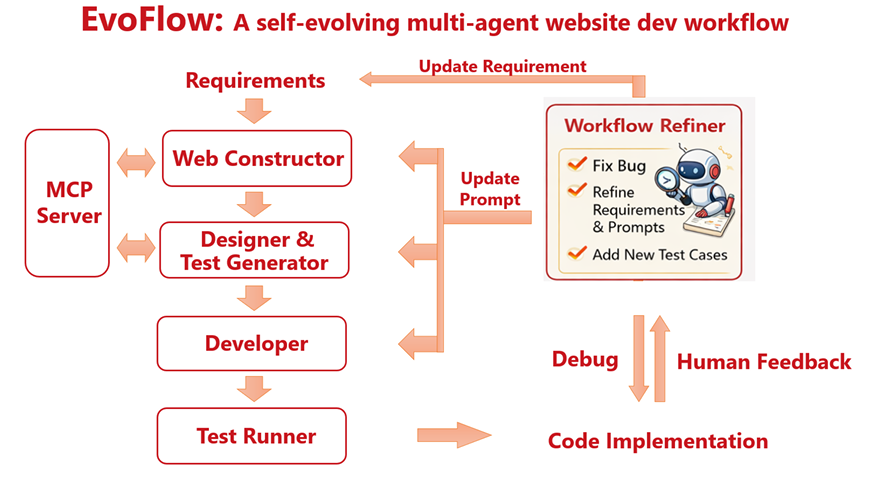

  

<h1 align="center">EvoFlow</h1>

A self-evolving multi-agent web development workflow.

EvoFlow is a self-evolving multi-agent web development workflow. It aims not only to help developers to build web applications more efficiently by automating the development process, but also to improve the reproducibility of the agent development workflow.

  

By learning from trial and error, EvoFlow can automatically refine the assets of the workflow, ensuring the workflow will not make the same mistakes the next time, thus enhancing the stability of the workflow.

This repo is an example of replicating the Ctrip website using EvoFlow. If you would like to replicate our work, please switch to the 'reproduce' branch, where only the code for reproducing the Ctrip-Replica project is included.

The structure of this repo (main branch) is as follows:

- `agent_prompt/`: The prompts for the agents in EvoFlow.
- `requirements/`: The requirements for the Ctrip-Replica website.
- `manual_prompt/`: The example of manual prompt needed for the agents.
- `GUIDE.html/GUIDE.md`: A step-by-step guide to reproduce the Ctrip-Replica project.
- `frontend/`,`backend/`,`.artifacts/`,...: The code for the Ctrip-Replica website.

## Reproduce the Ctrip-Replica Project using EvoFlow

Follow the steps in our GUIDE.
**GUIDE.html** is recommended (you will need a browser) for more support, visualization and readability. **GUIDE.md** is also provided for those who prefer to read in plain text.

